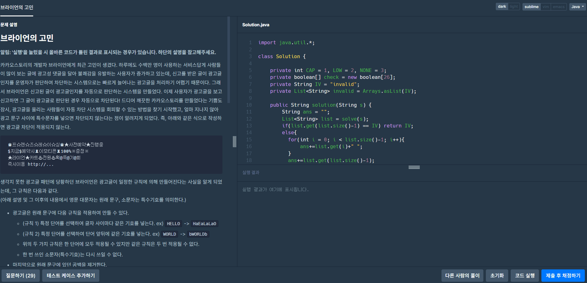
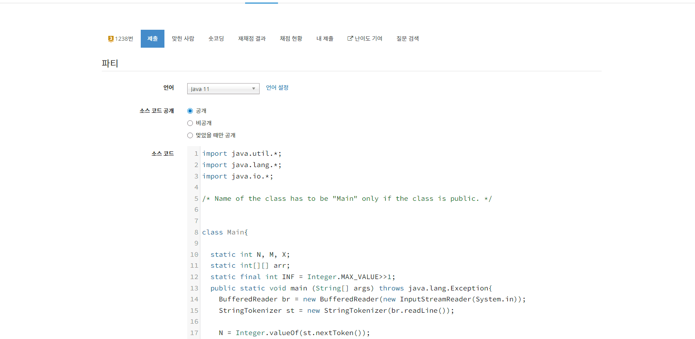
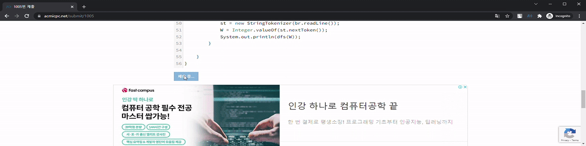

# Algolog

Algolog는 코딩테스트 풀이의 전 과정을 기록하고, 제출 이력과 성장 흐름을 돌아볼 수 있게 돕는 Chrome 확장 프로그램입니다.

Algolog is a Chrome extension for preserving the full coding-test workflow instead of only the final accepted answer. It records submission attempts to GitHub, shows per-problem history in a Side Panel, supports multiple judge adapters, and can optionally connect a dashboard, Notion review notes, and AI feedback.

## Why I Built It / 만든 이유

I used BaekjoonHub while solving coding tests, but it only committed the final accepted answer to Git and the entire trial-and-error, problem-solving process disappeared. Instead of keeping a separate journal, I forked the open-source extension and rebuilt it to record every submission automatically.

코딩테스트를 풀면서 BaekjoonHub를 쓰고 있었는데, Git에는 최종 정답만 커밋되고 끝이었습니다. 몇 번 틀렸는지, 얼마나 걸렸는지, 어떤 코드가 오답이었는지, 풀이 과정 전체가 사라졌습니다. 따로 기록하는 대신 오픈소스를 fork해서 모든 제출을 자동 기록하도록 직접 고쳤습니다.

## 화면 / Product walkthrough

| Programmers | Baekjoon | Submission output |
| --- | --- | --- |
|  |  |  |

The GIFs above are captured from the extension workflow and make it possible to review the interaction model without installing the unpacked extension first.

## 핵심 기능

- 모든 제출 시도를 GitHub에 자동 커밋
- 정답, 오답, 시간초과, 런타임 에러 등 결과별 파일 기록
- Side Panel에서 커밋 성공 여부, 파일명, 현재 문제 시도 현황 확인
- 프로그래머스, 백준, SWEA, LeetCode 어댑터 기반 확장 구조
- 선택 기능으로 Notion 오답노트, GitHub Pages 대시보드, AI 피드백 제공

## 저장 규칙

```text
/{사이트명}/{레벨or티어}/{문제번호}. {문제명}/
  YYYYMMDD_HHMMSS_{result}_{문제명}.{ext}
```

예시:

```text
/프로그래머스/lv2/42586. 기능개발/
  20260501_143022_wrong_기능개발.py
  20260501_143311_correct_기능개발.py

/백준/silver/1000. A+B/
  20260501_150000_correct_A+B.py
```

## 로컬 설치

1. Chrome에서 `chrome://extensions`를 엽니다.
2. 오른쪽 위의 개발자 모드를 켭니다.
3. `압축해제된 확장 프로그램을 로드`를 눌러 이 저장소 폴더를 선택합니다.
4. Algolog 아이콘을 눌러 GitHub 인증과 저장소 연결을 진행합니다.

## 대시보드

[dashboard/index.html](dashboard/index.html)을 브라우저에서 열고 `username/repo-name` 형식으로 public 풀이 저장소를 입력하면 제출 통계를 확인할 수 있습니다.

GitHub Pages 배포는 [.github/workflows/deploy-dashboard.yml](.github/workflows/deploy-dashboard.yml)에서 관리합니다.

## AI 피드백

팝업의 `AI 피드백` 섹션에서 Groq, DeepSeek, OpenAI, Anthropic API Key를 직접 입력할 수 있습니다. 여러 키를 줄바꿈으로 저장하면 요청마다 순환 사용하며, 키를 설정하지 않아도 GitHub 커밋 기능은 그대로 동작합니다.

## 문서

작업 계획과 Phase별 로그는 [docs/tasks](docs/tasks) 아래에 정리되어 있습니다.

## Topics

[`baekjoon`](https://github.com/topics/baekjoon) · [`browser-extension`](https://github.com/topics/browser-extension) · [`chrome-extension`](https://github.com/topics/chrome-extension) · [`coding-test`](https://github.com/topics/coding-test) · [`developer-tools`](https://github.com/topics/developer-tools) · [`github`](https://github.com/topics/github) · [`javascript`](https://github.com/topics/javascript) · [`programmers`](https://github.com/topics/programmers)
